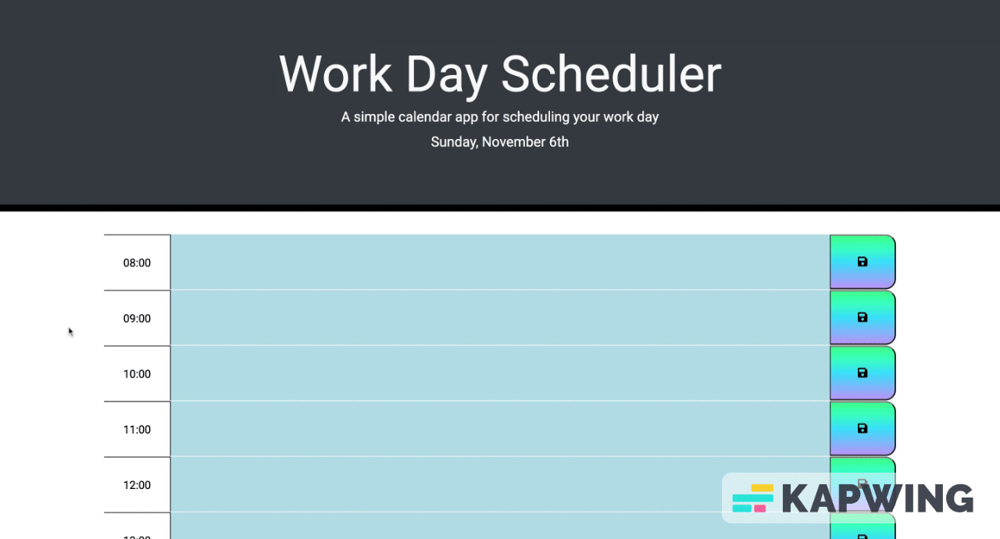

  

  

<h1>
  hey there
  
</h1>

  

# Hi, it's my "Work Day Scheduler" app.

A simple calendar application that allows the user to save events for each hour of the day. This app is running in the browser and featuring dynamically updated HTML and CSS powered by jQuery. It also feature a clean and polished user interface and is responsive, ensuring that it adapts to multiple screen sizes.

The following animation demonstrates the application functionality:

My app at github repository: https://github.com/Havrushchenko/work-day-scheduler

My app is live at github pages: https://havrushchenko.github.io/work-day-scheduler/